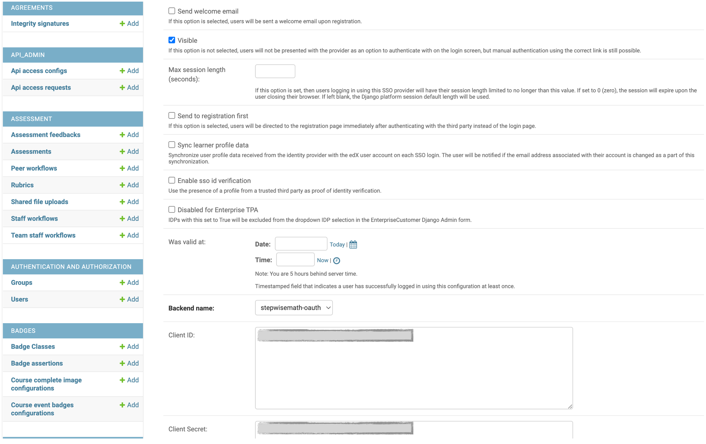
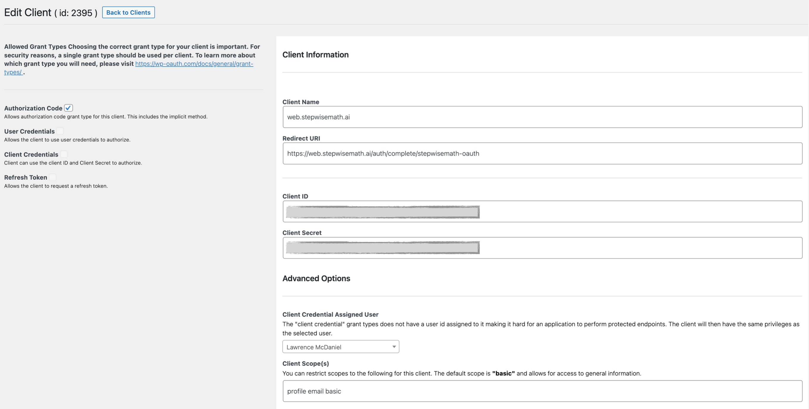

Wordpress OAuth2 Backend Open edX / 
===================================

Overview
--------

A Python Social Auth backend for `WP OAuth <https://wp-oauth.com/>`_ this is customized for use with Open edX.

- `Python Social Auth custom backend implentation <https://python-social-auth.readthedocs.io/en/latest/backends/implementation.html>`_
- `WP Oauth Wordpress Plugin Documentation <https://wp-oauth.com/docs/>`_

`lms.log <./doc/lms.log>`_

Usage
-----

..  code-block:: python

  from wp_oauth_backend.wp_oauth import WPOpenEdxOAuth2

  class StepwiseMathWPOAuth2(WPOpenEdxOAuth2):

      # This defines the backend name and identifies it during the auth process.
      # The name is used in the URLs /login/<backend name> and /complete/<backend name>.
      #
      # This is the string value that will appear in the LMS Django Admin
      # Third Party Authentication / Provider Configuration (OAuth)
      # setup page drop-down box titled, "Backend name:", just above
      # the "Client ID:" and "Client Secret:" fields.
      name = "stepwisemath-oauth"

      # note: no slash at the end of the base url. Python Social Auth
      # might clean this up for you, but i'm not 100% certain of that.
      BASE_URL = "https://stepwisemath.ai"

Open edX Setup
--------------

.. image:: doc/django-admin-1.png
  :width: 100%
  :alt: Open edX Django Admin Add Provider Configuration (OAuth)

General Python/Django
~~~~~~~~~~~~~~~~~~~~~

include this repo in your project's requiremets.txt, or install it from the command line.

..  code-block:: shell

  cd path/to/your/project
  source path/to/venv/bin/activate
  pip install https://github.com/StepwiseMath/wp-oauth-backend

..  code-block:: yaml

  ADDL_INSTALLED_APPS:
  - "wp_oauth_backend"
  THIRD_PARTY_AUTH_BACKENDS:
  - "wp_oauth_backend.wp_oauth.StepwiseMathWPOAuth2"
  ENABLE_REQUIRE_THIRD_PARTY_AUTH: true

add these settings to django.conf:

.. list-table:: WP Oauth setup
  :widths: 50 100
  :header-rows: 1

  * - Key
    - Value
  * - WPOAUTH_BACKEND_BASE_URL
    - https://stepwisemath.ai
  * - WPOAUTH_BACKEND_CLIENT_ID
    - see: https://stepwisemath.ai/wp-admin/admin.php?page=wo_manage_clients
  * - WPOAUTH_BACKEND_CLIENT_SECRET
    - see: https://stepwisemath.ai/wp-admin/admin.php?page=wo_manage_clients
  * - SCOPE
    - basic email profile
  * - GRANT_TYPE
    - Authorization Code
  * - REDIRECT_URI
    - https://web.stepwisemath.ai/auth/complete/stepwisemath-oauth

Cookiecutter openedx_devops build
~~~~~~~~~~~~~~~~~~~~~~~~~~~~~~~~~

..  code-block:: shell

  - name: Add the wp-oauth-backend
    uses: openedx-actions/tutor-plugin-build-openedx-add-requirement@v1.0.0
    with:
      repository: wp-oauth-backend
      repository-organization: StepwiseMath
      repository-ref: main
      repository-token: ${{ secrets.PAT }}

Cookiecutter openedx_devops deployment
~~~~~~~~~~~~~~~~~~~~~~~~~~~~~~~~~~~~~~

..  code-block:: shell

  tutor config save --set OPENEDX_WPOAUTH_BACKEND_BASE_URL="${{ secrets.WPOAUTH_BACKEND_BASE_URL }}" \
                    --set OPENEDX_WPOAUTH_BACKEND_CLIENT_ID="${{ secrets.WPOAUTH_BACKEND_CLIENT_ID }}" \
                    --set OPENEDX_WPOAUTH_BACKEND_CLIENT_SECRET="${{ secrets.WPOAUTH_BACKEND_CLIENT_SECRET }}"

WP Oauth Plugin Configuration
-----------------------------

This plugin enables your Open edX installation to authenticate against the WP Oauth plugin provider
in https://stepwisemath.ai/, configured as follows:

